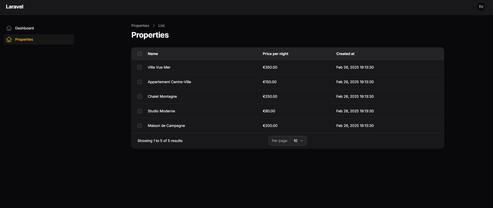

# Neoventure

## Introduction 

Neoventure est un site de booking de résidences. Il permet à l'utilisateur d'en réserver une en ligne aisni que de consulter les résidences disponibles.

## Technologies utilisées

- Laravel
- TailwindCSS
- Filament
- Livewire
- NodeJS

## Installation

1. Cloner le repository
2. Exécuter `composer install`
3. Exécuter `npm install`
4. Exécuter `php artisan serve`

## Fonctionnalités

- Inscription
- Connexion
- Déconnexion
- Consulter les résidences disponibles
- Réserver une résidence

## Illustrations

